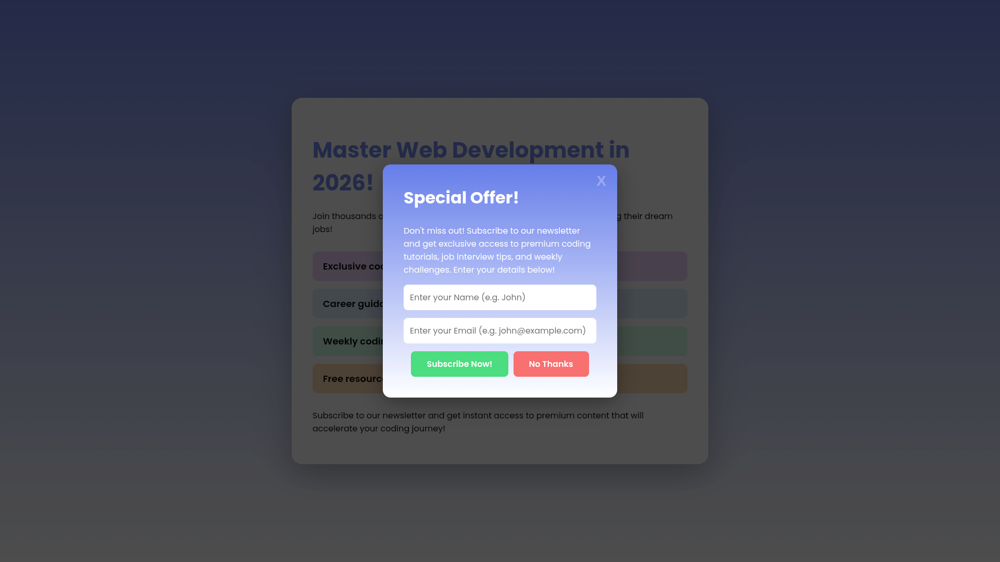

# 🎯 Newsletter Popup From Hell - Exercise Template




<br>


A hands-on JavaScript exercise template for learning form handling, DOM manipulation, and CSS animations by building a humorous "annoying newsletter popup". Perfect for reinforcing concepts from the Scrimba "World's Most Annoying Cookie Consent" module.

## 📚 About This Template

This is a **starter template** designed for practice and learning. The HTML and CSS are provided, and your job is to complete the JavaScript challenges to make the popup functional and interactive!

## 🎓 What You'll Learn

By completing this exercise, you'll practice:

- ⏱️ **setTimeout()** - Delaying actions and creating sequences
- 🎯 **Event Listeners** - Handling click and hover events
- 📝 **FormData API** - Extracting data from forms
- 🔄 **DOM Manipulation** - Dynamically updating page content
- 🎨 **CSS Class Toggling** - Changing styles with JavaScript
- ✨ **Flexbox Tricks** - Reversing element order with flex-direction
- 🌀 **CSS Animations** - Creating loading spinners with keyframes

## 🚀 Getting Started

### Prerequisites

- Basic understanding of HTML, CSS, and JavaScript
- A text editor (VS Code, Sublime Text, etc.)
- A web browser

### Installation

1. **Use this template** by clicking the "Use this template" button above, or clone the repository:

   ```bash
   git clone https://github.com/yourusername/newsletter-popup-from-hell-exercise-template.git
   ```

2. **Navigate to the project folder:**

   ```bash
   cd newsletter-popup-from-hell-exercise-template
   ```

3. **Open `index.html` in your browser** to see the starter page

4. **Open the project in your code editor** and start coding!

## 📋 Challenges to Complete

### Challenge 1: Popup Display ⏰

Make the popup appear 2 seconds after the page loads.

**Hint:** Use `setTimeout()` and change the display style.

---

### Challenge 2: Close Button 🚪

Make the close button (X) hide the popup when clicked.

**Hint:** Add a click event listener to hide the modal.

---

### Challenge 3: Reverse Buttons CSS 🔄

In `styles.css`, create a class called `reverse-buttons` that uses `flex-direction` to reverse the order of the buttons.

**Hint:** Look for the TODO comment in the CSS file.

---

### Challenge 4: Button Hover Effect 🎭

Toggle the `reverse-buttons` class on the button container when the user hovers over the "No Thanks" button.

**Hint:** Use `mouseenter` event and `classList.toggle()`.

---

### Challenge 5: Form Submission 📝

Handle the form submission with multiple steps:

1. Prevent the default form behavior
2. Get form data using the FormData API
3. Extract the `firstName` value
4. Show a loading screen with spinner and message "Processing your subscription..."
5. After 2 seconds, update the message to "Adding you to our mailing list..."
6. After 4 seconds total, show a success message with the person's name
7. Enable the close button

**Hint:** You'll need multiple `setTimeout()` calls and `innerHTML` updates.

---

### 🎨 BONUS Challenge

Add your own creative touches to the success message! Make it funny, add GIFs, or customize the styling.

## 📂 File Structure

```
newsletter-popup-exercise-template/
│
├── index.html          # HTML structure (provided)
├── styles.css          # Styling with one TODO for you
├── script.js           # JavaScript file with TODOs
└── README.md           # This file
```

## 💡 Tips for Success

- Read all the TODO comments carefully in `script.js`
- Test your code frequently in the browser
- Use `console.log()` to debug your code
- The challenges build on each other - complete them in order
- Don't be afraid to look up documentation on MDN
- Have fun with the bonus challenge!

## 🔍 What to Expect

**Before completing the exercise:**

- Popup doesn't appear automatically
- Close button doesn't work
- Buttons don't swap on hover
- Form submission doesn't do anything

**After completing the exercise:**

- Popup appears 2 seconds after page load
- Close button hides the popup
- Hovering over "No Thanks" swaps button positions
- Form submission shows loading states and success message
- Your own creative touches on the success message!

## 📚 Learning Resources

- [MDN - setTimeout()](https://developer.mozilla.org/en-US/docs/Web/API/setTimeout)
- [MDN - FormData](https://developer.mozilla.org/en-US/docs/Web/API/FormData)
- [MDN - addEventListener()](https://developer.mozilla.org/en-US/docs/Web/API/EventTarget/addEventListener)
- [MDN - classList](https://developer.mozilla.org/en-US/docs/Web/API/Element/classList)
- [CSS Tricks - Flexbox Guide](https://css-tricks.com/snippets/css/a-guide-to-flexbox/)

## 🎯 Concepts Covered

| Concept          | Description                       | Difficulty        |
| ---------------- | --------------------------------- | ----------------- |
| setTimeout       | Delaying code execution           | ⭐ Beginner       |
| Event Listeners  | Responding to user interactions   | ⭐ Beginner       |
| FormData API     | Extracting form values            | ⭐⭐ Intermediate |
| DOM Manipulation | Changing page content dynamically | ⭐⭐ Intermediate |
| Class Toggling   | Dynamic styling with classList    | ⭐ Beginner       |

## 🤝 Contributing

This is a learning template! Feel free to:

- Fork the repository
- Add your own challenges
- Improve the documentation
- Share your completed version

## 📄 License

This project is open source and available under the [MIT License](LICENSE).

## 🙏 Acknowledgments

Inspired by the Scrimba module: **"The World's Most Annoying Cookie Consent"**

## 💬 Need Help?

- Check the comments in the code files
- Review the learning resources above
- Open an issue if you find a bug
- Share your completed version with others!

---

⭐ **Remember:** This project satirizes annoying popup patterns. Please use ethical UX practices in real-world applications!

Happy coding! 🚀
